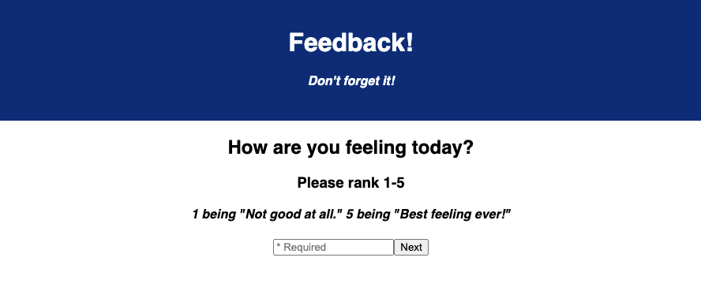
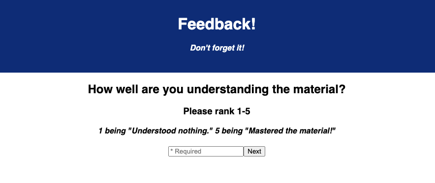
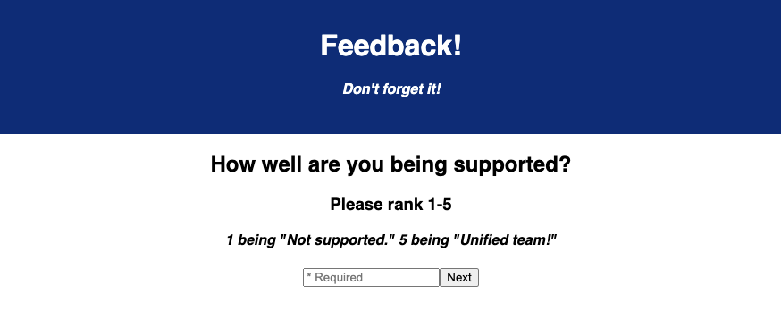
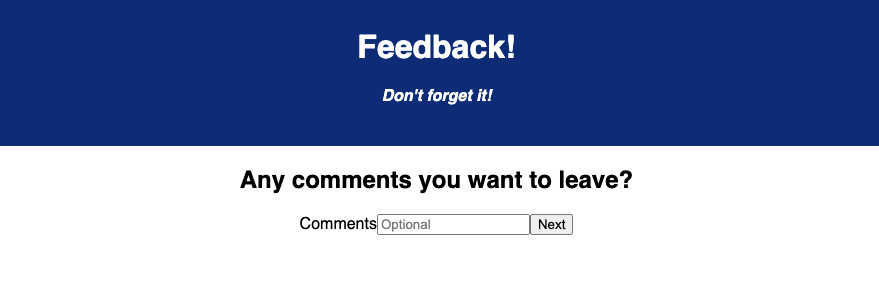

# Feedback Form

### Duration

12 Hour Sprint


## Description

This app allows users to give their feedback on their class experience each day. Having the user use a numerical ranking system (1-5, 1 being the most negative and 5 being the most positive) for the required fields including their general feeling, understanding of the content, and support from staff and classmates.


There is also an optional page for comments to give additional feedback or suggestions. After the survey is complete the user will be able to review their feedback before submitting. Once the user clicks submit they are brought to a 'Thank You' page with the option to start a new feedback submission.


## Page Views

Here are views of the following pages:

### Feeling



### Understanding 



### Support



### Comments



### Review


### Thank You


## Setup 

Clone this repository and install the node modules.


### Prerequisites

This is a React application so the server and client will have to be run in separate terminal tabs: 
* npm
  ```sh
  - npm install
  - npm run server
  - npm run client
  ```

### Built With

This application was built with the following frameworks/libraries

- JavaScript, JSX
- React.js
- Redux
- Node.js
- Express
- JSON
- PostgreSQL
- SQL
- Postico


## Acknowledgement

Thanks to [Prime Digital Academy](www.primeacademy.io) who equipped and helped me to make this application a reality.  

## Support

If you have suggestions or issues, please [email](clay_webb@outlook.com) me or connect with me on my [LinkedIn](https://www.linkedin.com/in/clay-webb-5029b7180)
